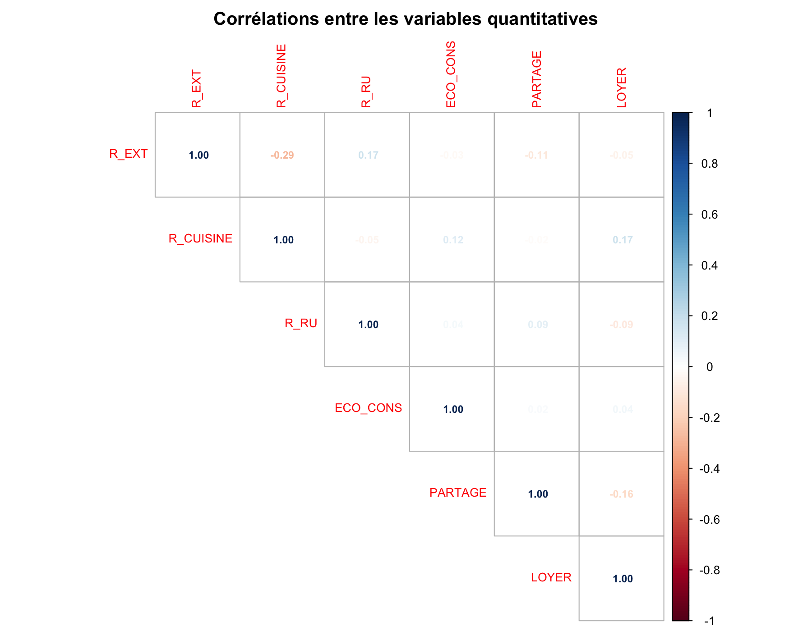
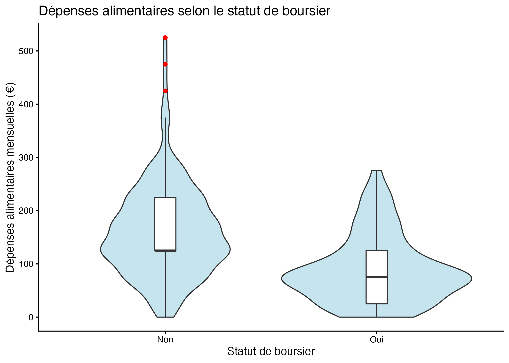
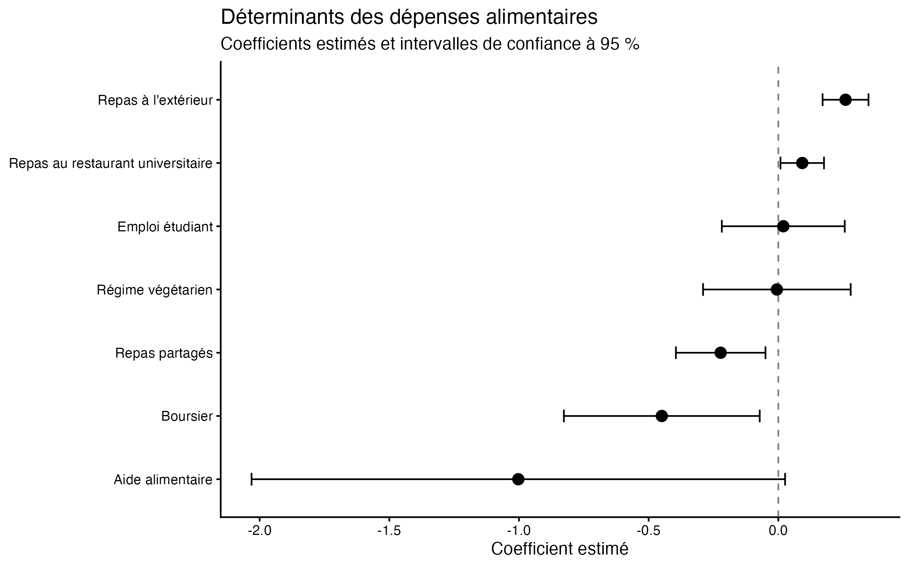

# Déterminants des dépenses alimentaires des étudiants

Projet d'économétrie réalisé dans le cours d'économétrie linéaire avancée par Muriel Travers dans le Master 1 Économétrie Appliquée à l'IAE Nantes.

L'objectif est d'identifier les principaux facteurs associés au montant mensuel des dépenses alimentaires des étudiants à partir de données collectées par questionnaire.

## Objectif

L'étude cherche à comprendre dans quelle mesure les caractéristiques économiques, universitaires et les habitudes de consommation des étudiants sont associées à leurs dépenses alimentaires mensuelles.

L'analyse repose notamment sur :

- l'exploration et le nettoyage des données ;
- l'analyse descriptive ;
- la détection et le traitement des valeurs atypiques ;
- l'étude des corrélations entre variables ;
- la sélection de variables ;
- l'estimation de modèles de régression linéaire ;
- les diagnostics économétriques ;
- l'étude de l'endogénéité ;
- la correction de l'hétéroscédasticité.

## Données

Les données proviennent d'un questionnaire réalisé auprès d'étudiants.

- **242 réponses collectées**
- **222 étudiants retenus** après exclusion des non-étudiants
- Variables portant notamment sur les dépenses alimentaires, les ressources financières, le logement, l'emploi étudiant et les habitudes de consommation

Les données individuelles originales ne sont pas publiées afin de préserver la confidentialité des répondants.

Une **version anonymisée** est disponible dans le dossier `data/` afin de permettre l'exécution du code et la reproduction de la démarche d'analyse.

> Les résultats obtenus avec la base anonymisée peuvent légèrement différer de ceux présentés dans le rapport original en raison de l'anonymisation de certaines variables.

## Démarche

### 1. Préparation et exploration des données

Les données sont nettoyées et transformées avant l'analyse. Des statistiques descriptives et différentes visualisations permettent ensuite d'étudier la distribution des variables.

Les valeurs atypiques sont étudiées notamment à l'aide des tests de **Grubbs** et de **Rosner**.

### 2. Analyse des relations entre variables

Les relations entre variables quantitatives sont étudiées à l'aide des **corrélations de Spearman**.



Les associations entre variables qualitatives sont également étudiées à l'aide du **V de Cramér**.

### 3. Modélisation économétrique

Plusieurs spécifications sont estimées par **moindres carrés ordinaires (MCO)**.

La sélection des variables est réalisée à l'aide de procédures :

- ascendante ;
- descendante ;
- bidirectionnelle.

Les modèles font ensuite l'objet de plusieurs diagnostics : normalité des résidus, test RESET, VIF, test de Breusch-Pagan et distances de Cook.

Une seconde analyse est également réalisée en excluant les étudiants en alternance.

### 4. Endogénéité et hétéroscédasticité

L'hypothèse d'endogénéité de certaines variables est étudiée à l'aide de variables instrumentales.

Les diagnostics indiquent que certains instruments envisagés sont faibles et ne permettent pas de privilégier une estimation IV.

Après détection d'hétéroscédasticité dans le modèle sans alternants, une estimation par **moindres carrés quasi généralisés (FGLS/WLS)** est utilisée comme modèle final.

## Quelques résultats

### Dépenses et statut de boursier

La distribution des dépenses alimentaires diffère selon le statut de boursier.



### Déterminants identifiés par le modèle final

Le graphique suivant présente les coefficients estimés par le modèle final ainsi que leurs intervalles de confiance à 95 %.



L'analyse met notamment en évidence des associations entre les dépenses alimentaires et :

- les repas pris à l'extérieur ;
- les repas au restaurant universitaire ;
- le statut de boursier ;
- le partage des repas.

Ces résultats correspondent à des **associations statistiques conditionnelles au modèle estimé** et ne doivent pas être interprétés automatiquement comme des effets causaux.

## Technologies

**Langage :** R

**Manipulation et visualisation :**
- `dplyr`
- `tidyverse`
- `ggplot2`
- `readxl`
- `corrplot`
- `reshape2`

**Économétrie et statistiques :**
- `car`
- `lmtest`
- `AER`
- `sandwich`
- `EnvStats`
- `outliers`
- `PerformanceAnalytics`
- `broom`

## Structure du dépôt

```text
depenses-alimentaires-etudiants/
├── README.md
├── code/
│   └── analyse_depenses_alimentaires.qmd
├── data/
│   └── donnees_anonymisees.xlsx
├── figures/
│   ├── correlation_spearman.png
│   ├── depenses_boursier.png
│   └── coefficients_modele_final.png
├── rapport/
│   └── rapport.pdf
└── depenses-alimentaires-etudiants.Rproj
```

## Rapport

Le rapport complet de l'étude est disponible ici :

➡️ [Consulter le rapport](rapport/rapport.pdf)

## Auteurs

Projet universitaire réalisé par :

- **Amélie Pires**
- Samuel Le Nenes
- Nassim Ikhelef

Master 1 Économétrie Appliquée — Économétrie linéaire avancée — IAE Nantes, 2025-2026.

## Contact

**Amélie Pires**

[Mail : amelie.pires@hotmail.com](mailto:amelie.pires@hotmail.com) · [LinkedIn](https://www.linkedin.com/in/amelie-pires) · [GitHub](https://github.com/aps-18)
